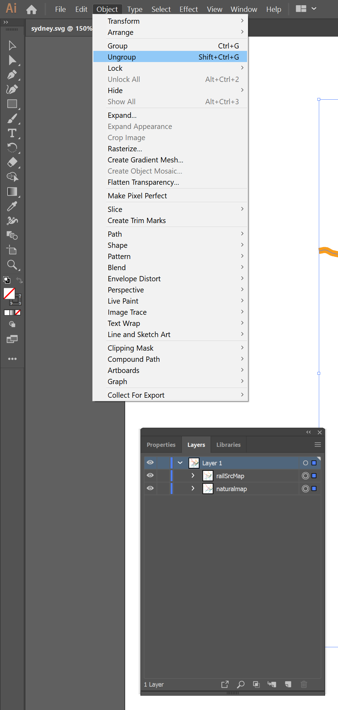
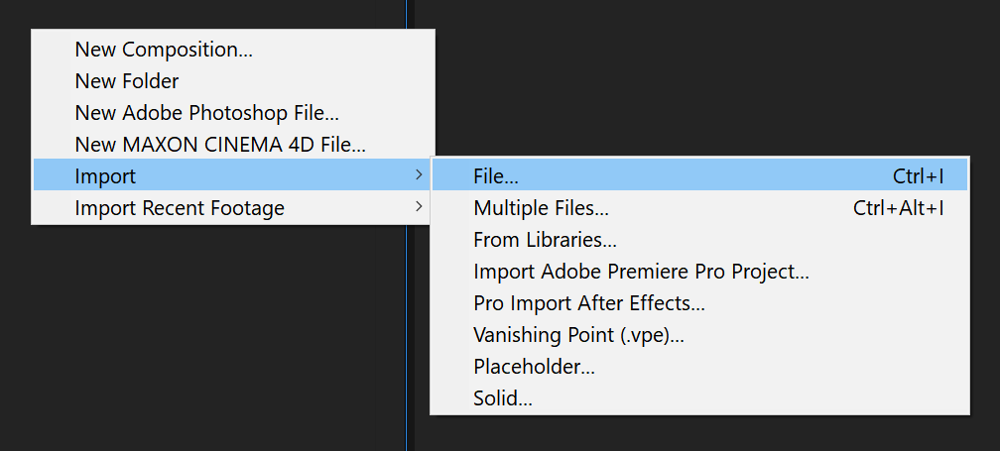

# Rail Map Transformation

Aka Map vs Geo. Sydney/Adelaide source release.

## HTML Version

The HTML version serves only as a proof of concept to the genericness of the output described in the [General Strategy](#general-strategy)

[Snap.svg](https://github.com/adobe-webplatform/Snap.svg) is used to handle the path animation

- [Adelaide html](http://htmlpreview.github.io/?https://github.com/megalomega/RailMapTransformation-release/blob/master/adelaide/index.html)

- [Sydney html](http://htmlpreview.github.io/?https://github.com/megalomega/RailMapTransformation-release/blob/master/sydney/index.html)

## Animation Instructions

### Illustrator

1. Open the [sydney/sydney.svg](sydney/sydney.svg) (or [adelaide/adelaide.svg](adelaide/adelaide.svg)) file
2. `Select ➜ All`  

3. `Object ➜ Ungroup` twice<br> 
4. `Layer Panel Hamburger ➜ Release to Layers (Sequence)`  

5. Rename all sublayer sequence names with their inner path's name.<br>  

6. Promote the sublayers to layers  

7. Delete the trailing `Layer 1`  

8. Save as a `.ai` file


### After Effects
1. Import the `.ai` file as a composition<br> 
2. `Edit ➜ Select All` layers in the imported composition
3. `Right Click ➜ Create ➜ Create Shapes from Vector Layer`  

4. For every <code>pn&nbsp;</code> prefixed layer, set a keyframe at `0:00:00:00` and `0:00:08:00` for `Contents/Group 1/Path 1/Path` and `Contents/Group 1/Transform: Group 1/Position`  
  

5. Solo  <code>pn&nbsp;</code> prefixed layers (can be done before Step 4)
  

6. Locate pairing <code>pm&nbsp;</code> prefixed layers (layers that match when <code>pm&nbsp;</code> is replaced with <code>pn&nbsp;</code>)  

7. Move paired layers next to one another (this is primarily for convenience)  

8. Seek the timeline to `0:00:03:00`  

9. Copy the both the `Contents/Group 1/Path 1/Path` and `Contents/Group 1/Transform: Group 1/Position` data from the <code>pm&nbsp;</code> layer  

10. Paste the subject data to the corresponding attributes in the <code>pn&nbsp;</code> layer  

11. Perform the same <code>pm&nbsp;</code> to <code>pn&nbsp;</code> copy process as Steps 9-10 at `0:00:05:00`  

12. Remember to reset the time to `0:00:00:00` before repeating Steps 4-11 for every <code>pn&nbsp;</code>/<code>pm&nbsp;</code> outline layer pair  

13. And you should be all done!  

14. Take note that tweening the position is important as the position changes between the <code>pn&nbsp;</code> and <code>pm&nbsp;</code> layers  


### AE Animation


## General Strategy

- Painstakingly trace PDF lines with illustrator (Metro lines): some of the PDFs could be opened directly in illustrator but the path data usually won't be *"complete"*, nor were they *"clean"*, in at least both of those cases tracing saves time rather than having to deal with bad data

 - *"complete"* case: the line data is incomplete usually when a train line forks, there weren't two continuous overlapped lines present in the PDF file, just one long continuous line representing the main branch, and a small line representing the secondary branch

 - *"clean"* case: line data wasn't clean in the case of lines that had a white dash in between

- Using the original PDF as reference, manually draw an ellipse at each station point on the Metro lines in illustrator (point mapping)

- Process GTFS points data into lines (True Geo lines)

- At this point, SVG should be the underlying technology used

- Generate the mapping between the Metro lines and the True Geo lines by "sampling" the Metro lines based on the points mapping (the ellipses are converted to x/y coordinates and translated as a percentage on their corresponding Metro lines)

- e.g. If there's 3 GTFS entries between Station D and Station E, Station D is at 40% of the Metro line and Station E is at 50% of the Metro line. Then "sample" the Metro line as a point at 40% (for Station D), 42.5%, 45%, 47.5%, and finally at 50% for Station E (keeping it continuous throughout the entire dataset, there's no need to draw Station E in this iteration as there'll be at least a Station Z - the "100%" terminus or another station - afterwards)

```js
const svg = document.createElementNS('http://www.w3.org/2000/svg', "svg");
const targetSVGPath = document.createElementNS('http://www.w3.org/2000/svg', "path");
svg.appendChild(targetSVGPath);
targetSVGPath.setAttribute("d", "M 0,100 0,300"); // An SVG Path with points [x, y]: [0,100], [0,300]
samplingData = [{
    "startPercent": 40,
    "endPercent": 50,
    "samplingRate": 1 / 4 * 10 // 3 points between Station A and Station B, 2.5% increments.
}]
metroMapPoints = [];
samplingData.forEach(function(e) {
    for (let i = e["startPercent"]; i < e["endPercent"] - 0.01; i += e["samplingRate"]) {
        console.log(i)
        pt = targetSVGPath.getPointAtLength(targetSVGPath.getTotalLength() * i / 100);
        metroMapPoints.push(pt);
    }
});
console.log(metroMapPoints);
// 40%: SVGPoint(x=0, y=180), 42.5%: SVGPoint(x=0, y=185), 45%: SVGPoint(x=0, y=190), 47.5%: SVGPoint(x=0, y=195)
```

- In theory, you'll end up with a 1:1 mapping between the Metro map and True Geo lines (assumption: the True Geo lines are always more complex than the Metro lines). This path data can be plugged into any morphing program, including After Effects, as shown in the [Instructions](#animation-instructions)

- With this approach, bus lines, ferries and all sorts of transit systems can be animated, but in the case of Hobart (the buslines each have a psuedo-metro map, but no cohesive network map), Darwin, Canberra, the maps are usually in True Geography form

## Licenses


- [CC BY 4.0](https://creativecommons.org/licenses/by/4.0/): Adelaide Metro - Government of South Australia. Changes made: data processing and transformation.

- [CC BY 4.0](http://opendefinition.org/licenses/cc-by/): Sydney Trains - Transport for NSW - New South Wales Government. Changes made: data processing and transformation.

- [CC BY-NC-SA 4.0](https://creativecommons.org/licenses/by-nc-sa/4.0/): megalomega (README/repo/project author)

 - When this text or any content as part of this repo is used, as reference or as a guide: you are only allowed to use it in a non-commercial context
    - Examples of what is not permitted, not limited to, is that you:
      1. Must not rehost this content on a how-to blog with advertisement(s)
      2. Must not capture/render/rehost the HTML/After Effect versions and post it on your advertisement-filled content aggregator page
  - and your derived work (with modifications or otherwise) must use the same CC BY-NC-SA 4.0 license with attribution.

```
Rail Map Transformation
Copyright (C) 2019 megalomega

This program is free software: you can redistribute it and/or modify
it under the terms of the GNU Affero General Public License as published by
the Free Software Foundation, either version 3 of the License, or
(at your option) any later version.

This program is distributed in the hope that it will be useful,
but WITHOUT ANY WARRANTY; without even the implied warranty of
MERCHANTABILITY or FITNESS FOR A PARTICULAR PURPOSE.  See the
GNU Affero General Public License for more details.

You should have received a copy of the GNU Affero General Public License
along with this program.  If not, see <http://www.gnu.org/licenses/>.
```
